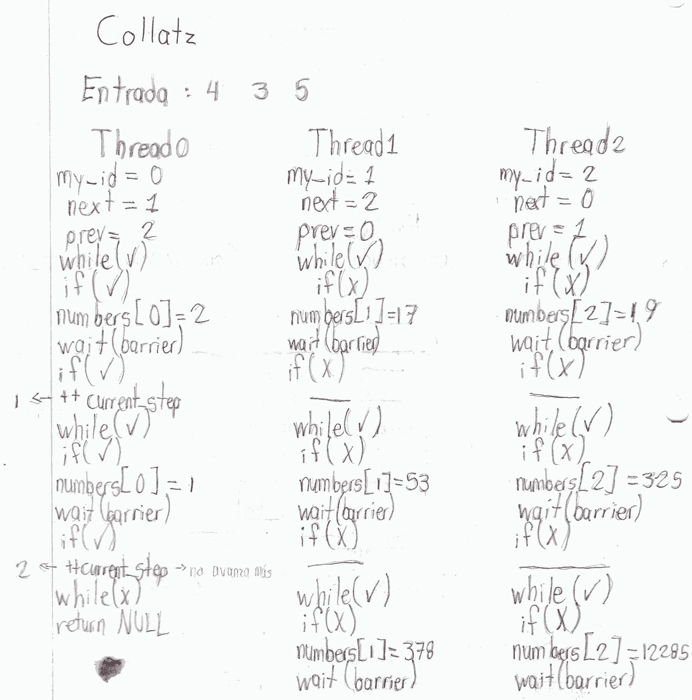

#Collatz

###Procesamiento

##¿Resuelve el código el problema?
No lo resuelve, pues existen problemas de sincronización entre los threads. Puede que los valores a los que acceden los threads no sean los correctos, sino que ya estén modificados, además del riesgo de que threads se queden esperando en la barrera a threads que ya salieron de la subrutina.