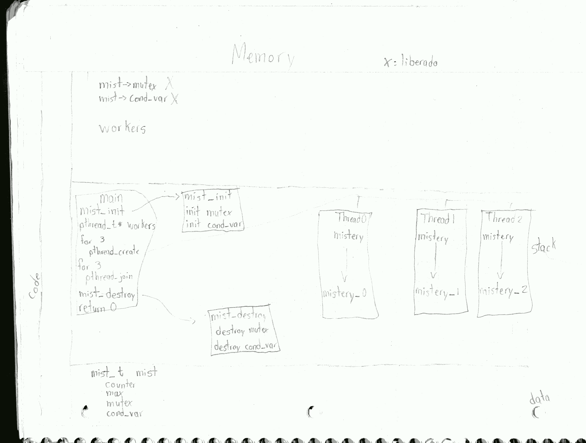
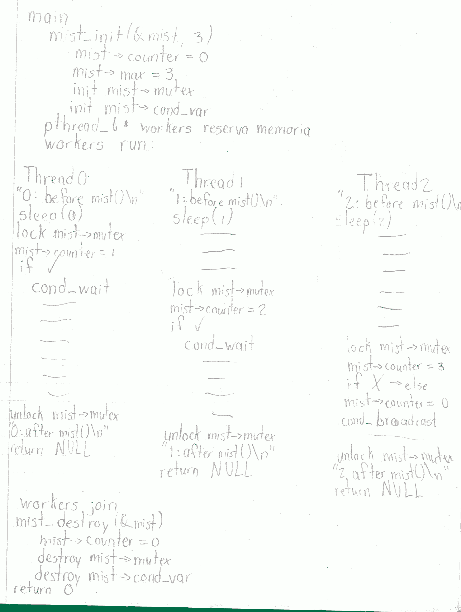

#Mist

###Rastreo de memoria del programa:

###Procesamiento

##Función mistery()
La función mistery actúa como un pthread_barrier. Haciendo uso de pthread_cond_var se asegura de que todos los threads hayan llegado al mismo punto antes de permitirles continuar su ejecución.