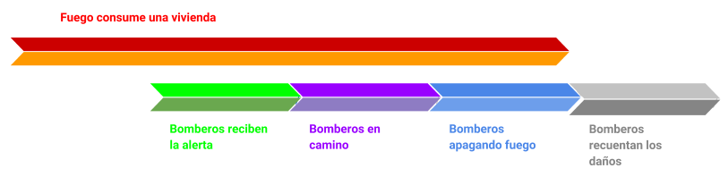
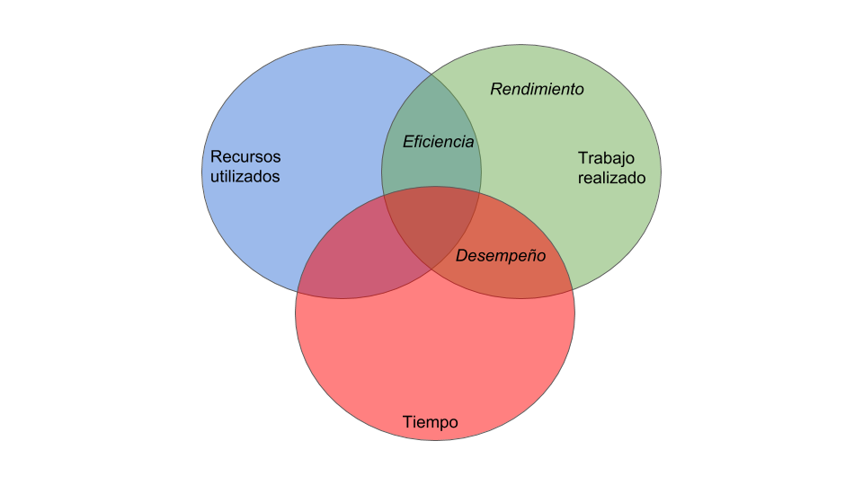

# Actividades de la sección "Material del curso"

## Actividad 1: act_cotidianas

1. Cenar: comer, tertuliar, reír. **Cambio de contexto**

2. Ver una película: observar la pantalla, escuchar los efectos de sonido, comer palomitas de maíz. **Paralelo**

3. Saciar una sed abundante: tomar agua, respirar, toser. **Cambio de contexto**

4. Alistarse: bañarse, vestirse, lavarse los dientes. **Serial**

5. Pintar una pared completa: impregnar el rodillo, pintar en la pared, rellenar la bandeja. **Cambio de contexto**

6. Planchar una tanda de ropa: planchar, escuchar música de despecho, cantar. **Paralelo**

7. Plantar una semilla: hacer un agujero en el suelo, depositar la semilla, rellenar el agujero. **Serial**

8. Plantar muchas semillas: hacer agujero en el suelo, depositar la semilla, rellenar el agujero. **Serial**

## Actividad 2: fireman

## Actividad 3: act_comput

1. Encontrar un archivo en una red P2P (en inglés, *peer to peer*).

2. Escribir un archivo XML.

3. Guiar a un conductor a llegar a su destino usando GPS.

4. Producir las imágenes a partir de los modelos en un videojuego.

5. Encontrar el n-ésimo estado de una matriz del juego de la vida.
6. Detectar si hay un movimiento en imágenes tomadas por un sistema de circuito cerrado  de televisión de un *mall*.

## Ejercicio 4: transmission_time_1

Con un total de 7549747.2 MB de datos y 28 máquinas, cada máquina debe procesar aproximadamente 269633 MB.

Como los archivos están en una sola máquina, esta tiene que transmitir 7280114 MB hacia las demás, y con una velocidad de red de unos 85 Mbps, se tardará aproximadamente 9.6 días en tener listos los datos.

## Ejercicio 5: transmission_time_2

## Ejercicio 6: perf_eff_thrp

**Eficiencia:** Relación de proporción entre el trabajo realizado por el equipo y los recursos utilizados.

**Desempeño:** Es una medida de cuántas unidades de información puede procesar un sistema en un período de tiempo.

**Rendimiento:** Cantidad de trabajo realizado por la máquina.

