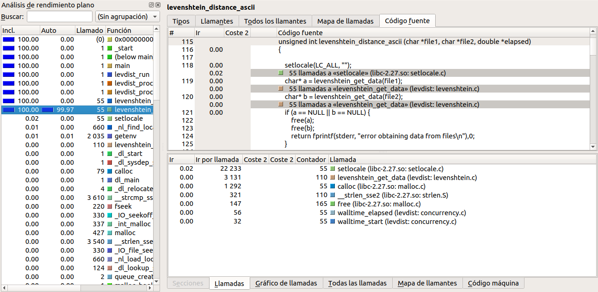
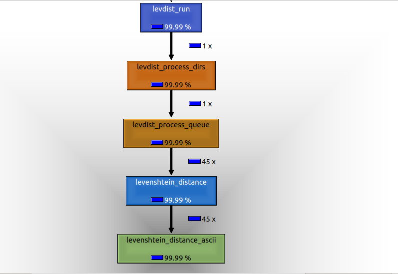
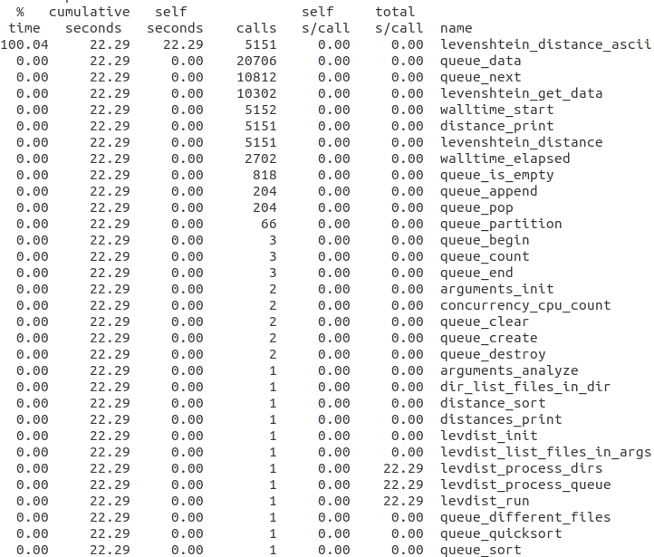
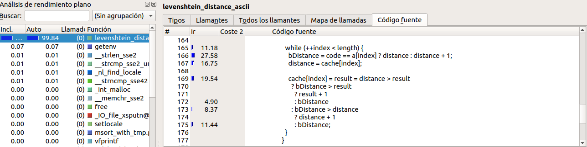
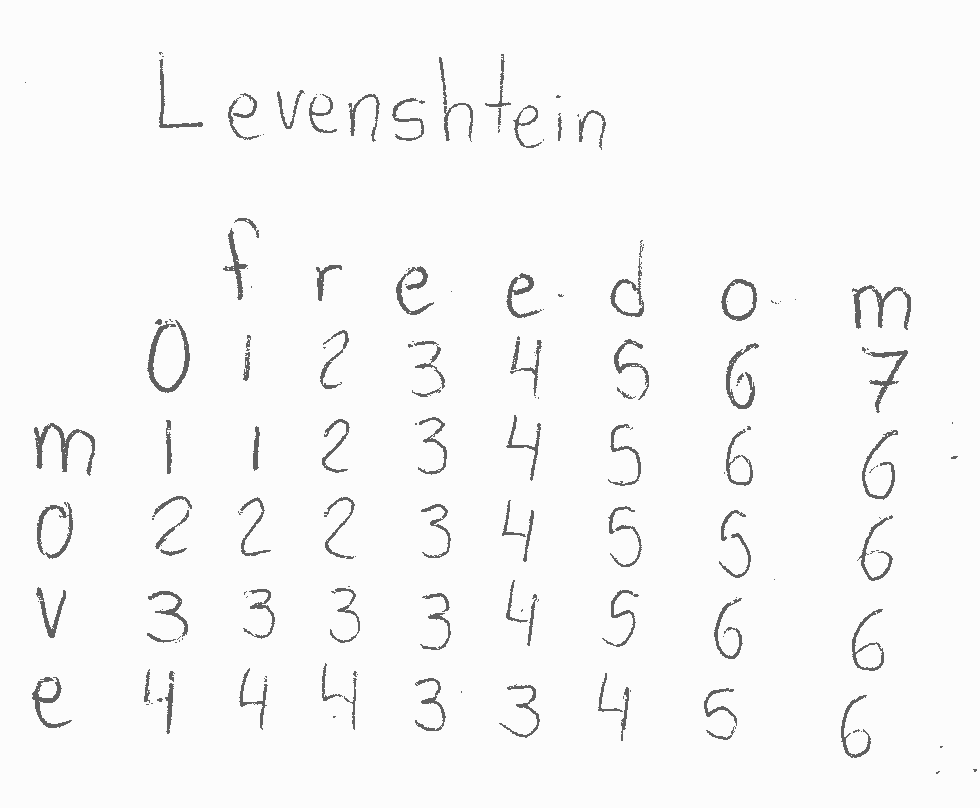
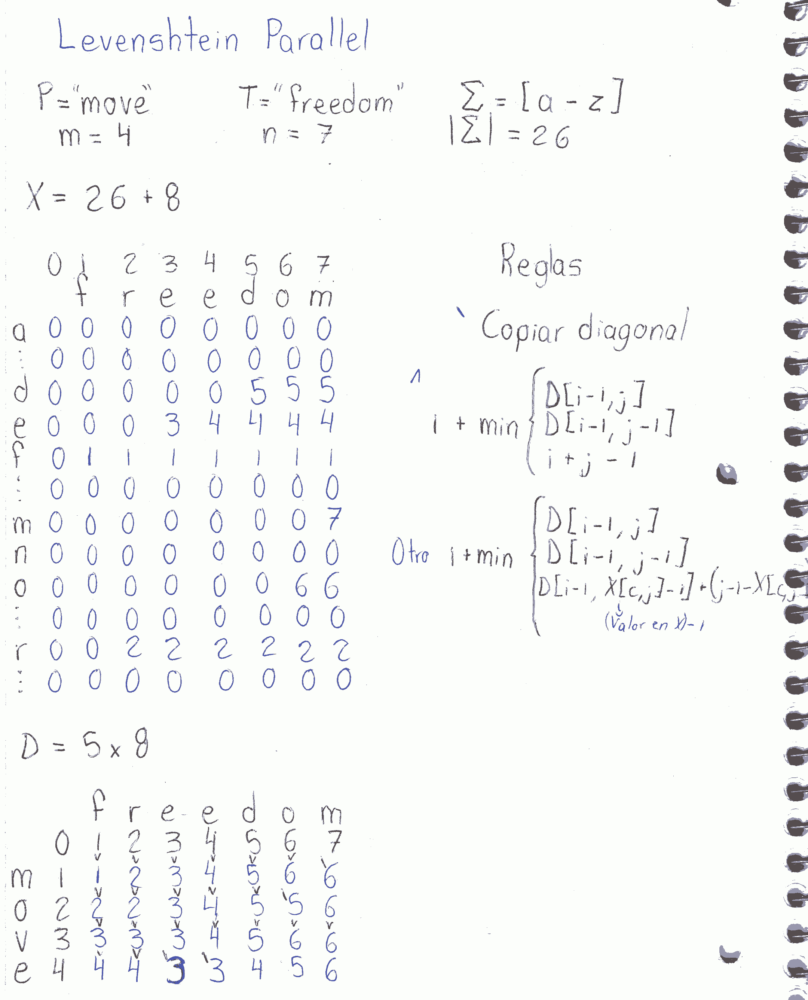

# levdist command optimizations

### callgrind tool results

#### Subroutine that consumes the most CPU

#### Call tree

### gprof tool results

#### Time profiling

These results coincide with both the elapsed time reported by the command and the CPU consumption reported by the callgrind tool.

### cachegrind tool results

The results show the next instructions to be the most likely to generate cache failures:

### Parallel design

Original Levenshtein distance algorithm:

Parallel Levenshtein distance algorithm:

